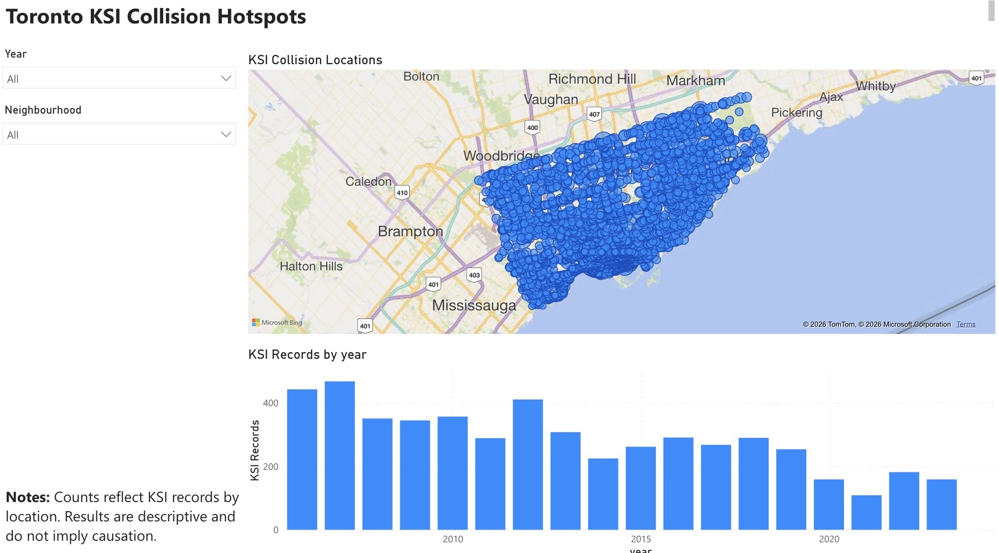
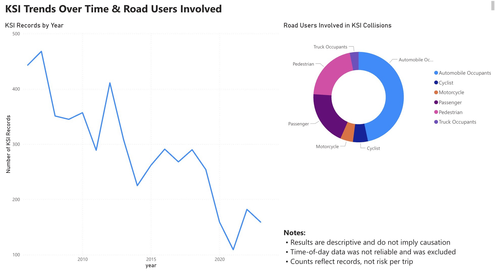

# Toronto KSI Traffic Collisions Analysis (Toronto Police Open Data)

Analyze **Killed or Seriously Injured (KSI)** traffic collisions in Toronto to identify **where** severe collisions cluster (hotspots), **when** they occur (trends/seasonality), and **who** is most impacted (road user groups).  
Built with **Python (pandas)** for cleaning/EDA and **Power BI** for interactive reporting.

---

## Why this project
KSI collisions are a key road-safety metric used by cities to monitor progress on traffic safety initiatives. This project is a **descriptive analytics** deep-dive that answers:

- **Hotspots:** Which locations repeatedly appear in KSI records?
- **Trends:** How have KSI counts changed over time?
- **Road users:** Which road user groups (e.g., pedestrians, cyclists, motorists) represent the largest share of KSI outcomes?

---

## Dashboard preview (Power BI)
> See the `powerbi/` folder for the report export / assets.

**Hotspots**

**Trends & road users**

---

## Data
**Source:** Toronto Police Service Public Safety Data Portal — KSI (Killed or Seriously Injured) collisions  
**Unit of analysis:** person-level collision records (each row represents an involved person in a KSI collision)  
**Geography:** City of Toronto  
**Time range:** depends on dataset availability at download time

> Note: Person-level records mean counts reflect **records**, not unique collisions, and do not measure exposure (e.g., trips, traffic volume).

---

## Method summary
### 1) Data preparation (Python)
- Loaded raw KSI open data
- Cleaned/standardized key fields (dates, road user category, location fields)
- Removed/ignored unreliable fields (see Limitations)
- Created analysis-ready extracts for dashboarding

### 2) Spatial analysis
- Aggregated records by location to identify **high-frequency KSI areas**
- Ranked top locations to surface repeat hotspots

### 3) Time-based analysis
- Yearly trend summaries
- Road-user breakdowns over time to compare how KSI composition changes

### 4) Visualization & reporting (Power BI)
- Built a report focused on:
  - hotspots + ranking views
  - time trends (yearly)
  - road user composition

---

## Key findings (descriptive, not causal)
- A subset of locations appear repeatedly in KSI records, forming identifiable **hotspots**.
- KSI counts **fluctuate over time** rather than following a single monotonic pattern.
- **Pedestrians** and **motor vehicle occupants** represent a large share of KSI records in the dataset.

---

## Repository structure
- `data/` — cleaned / analysis-ready datasets used for exploration and Power BI  
- `notebooks/` — Python notebooks for cleaning + EDA  
- `scripts/` — helper scripts (if you prefer running pipelines vs notebooks)  
- `powerbi/` — Power BI report files / exports  
- `visuals/` — images used in the README

---

## How to reproduce (high level)
1. Clone the repo
2. Create a Python environment and install dependencies (typical: `pandas`, `numpy`, `matplotlib`)
3. Run the notebooks in `notebooks/` to:
   - clean and validate fields
   - generate aggregated outputs
4. Open the Power BI file/export in `powerbi/` and refresh using the cleaned outputs in `data/`

> If you’d like, add a `requirements.txt` to make this fully one-command reproducible.

---

## Limitations
- **Time-of-day** was not reliable in the raw data (excluded from analysis).
- Results are **descriptive** and do not imply causation.
- Counts reflect **record volume**, not risk per trip/road user (no exposure denominators).
- Location fields may represent intersections/segments differently across years (hotspots should be interpreted as “repeat locations in records,” not engineering-grade site diagnosis).
